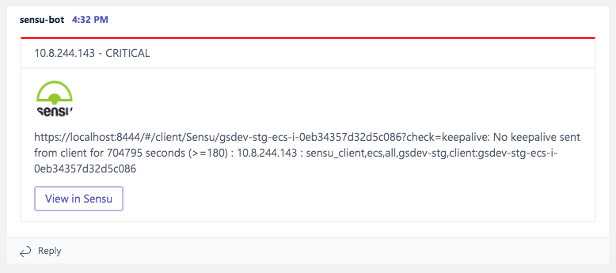

## Sensu-Plugins-Microsoft-Teams

## Screenshot



## Functionality

## Files

 * bin/handler-microsoft-teams.rb

## Usage

```shell
handler-microsoft-teams --webhook <url>
```

## Installation

[Installation and Setup](https://docs.sensu.io/plugins/latest/installation/)

To install the plugin, run `sensu-install -p microsoft-teams`.

## Notes

[Actionable message card reference](https://docs.microsoft.com/en-us/outlook/actionable-messages/card-reference)
